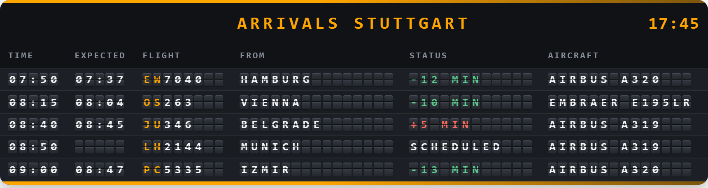
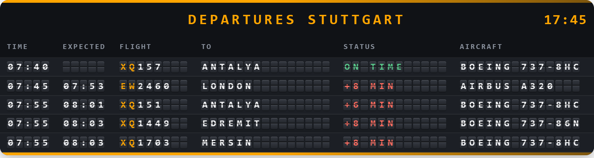
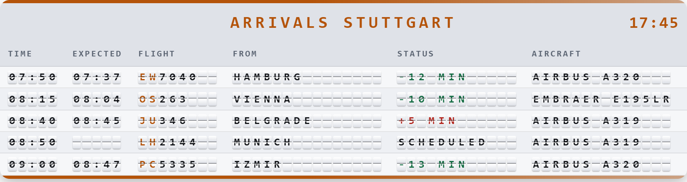

# FlightRadar24 Split-Flap Card

A custom Lovelace card for Home Assistant that renders flight data from the
[FlightRadar24 integration](https://github.com/AlexandrErohin/home-assistant-flightradar24)
as an animated split-flap airport board.

**Still in active development.** Feedback and contributions are welcome — see
[CONTRIBUTING.md](CONTRIBUTING.md).

More views (departures, light theme)

## Features

- Authentic split-flap animation — each character flips on its own, and only
  characters that actually changed are animated. Optionally, flaps can roll
  through the character sequence up to the target instead.
- Works with the integration's airport sensors: arrivals and departures
- Delay indicator: scheduled and expected time side by side, colour-coded
- Light and dark mode, following the Home Assistant theme automatically
- Customisable accent colour and edge bars (fading, solid, rainbow, or off)
- Responsive grid: flaps shrink until the board fits the card
- Bundled typeface — no fonts are loaded from third parties
- Multilingual interface (English, German, Spanish, French)
- Visual configuration editor — no YAML required, with a live preview of the
  board right in Home Assistant's card picker

## Requirements

- Home Assistant 2026.2.0 or newer
- [FlightRadar24 integration](https://github.com/AlexandrErohin/home-assistant-flightradar24),
  installed and configured

## Installation

### HACS (recommended)

1. Open HACS → **Frontend**
2. Three-dot menu at the top right → **Custom repositories**
3. Add the repository URL `https://github.com/GpsM2/flightradar24-splitflap-card`
   with category **Lovelace**
4. Search for "FlightRadar24 Split-Flap Card" and install it
5. Restart Home Assistant

### Manual

1. Download the latest version from
   [Releases](https://github.com/GpsM2/flightradar24-splitflap-card/releases)
2. Copy the **entire contents** of the `dist` folder to
   `/config/www/flightradar24-splitflap-card/` — that is
   `flightradar24-splitflap-card.js` **and** the `translations/` and `fonts/`
   folders. Without them the card still works, but falls back to English text
   and a system monospace font.
3. Add the resource in Home Assistant: **Settings** → **Dashboards** →
   **Resources** (three-dot menu at the top right) → **Add resource**
   - URL: `/local/flightradar24-splitflap-card/flightradar24-splitflap-card.js`
   - Resource type: **JavaScript module**
4. Clear the browser cache (Ctrl+F5)

## Adding the card

The card is set up through the Home Assistant interface — no YAML needed.

1. Edit the dashboard → **Add card**
2. Search for "FlightRadar24 Split-Flap Card" — the picker shows a live
   preview of the board, using one of your own sensors
3. Select it, then pick the sensor in the editor — only arrivals and
   departures boards are offered, other FlightRadar24 sensors are filtered out
4. Adjust the remaining options and save

From Home Assistant 2026.6 there is an even shorter route: when adding a card,
pick the sensor first and this card offers itself automatically.

> **Two boards side by side?** Add each board as its **own card**; don't combine
> them in a stack card (`vertical-stack`). A stack reports its own size to Home
> Assistant for the whole group, so the height of the boards inside it is no
> longer calculated correctly and the section overflows into the one below.

## Options

Every option is available in the visual editor. The YAML names below are listed
for reference only — for looking things up in the code editor, for instance.

| Option | Default | Meaning |
|---|---|---|
| `entity` | – | Arrivals or departures sensor (required) |
| `title` | automatic | Heading; empty = the board's direction |
| `language` | HA language | `en`, `de`, `es`, `fr` |
| `max_flights` | `8` | Number of flights shown |
| `board` | `auto` | `auto`, `arrivals`, `departures` |
| `theme` | `auto` | `auto`, `dark`, `light` |
| `accent_color` | theme colour | Custom accent colour |
| `rail_style` | `accent` | `accent`, `solid`, `rainbow`, `none` |
| `flip_style` | `flip` | `flip`, `scramble` |
| `flip_duration` | `800` | Flip animation duration (ms) |
| `flip_delay` | `50` | Delay between characters (ms) |
| `visible_fields` | all | Which columns are shown |

### Arrivals or departures

The card works out for itself whether the selected sensor is an arrivals or a
departures board, and adapts:

| | Arrivals | Departures |
|---|---|---|
| Column heading | `FROM` | `TO` |
| Time shown | scheduled arrival | scheduled departure |
| Automatic title | `ARRIVALS` | `DEPARTURES` |

This is detected from the sensor's icon, which the integration sets per
direction. Only if that fails — because the icon was overridden in Home
Assistant, for example — set the direction explicitly under **Board direction**
in the editor.

A flight only ever names the *other* airport: the origin on an arrivals board,
the destination on a departures board. That is why there is exactly one airport
column, whose heading changes with the direction.

## Supported entities

This card is an arrivals/departures board and works with the integration's
airport sensors:

- `sensor.flightradar24_airport_arrivals` — arrivals at an airport
- `sensor.flightradar24_airport_departures` — departures from an airport

It can show: time, expected time, flight number, origin/destination, status and
aircraft type.

The integration's area sensors (`current_in_area`, `entered_area`,
`exited_area`, `additional_tracked`) are deliberately not supported — they carry
live position data rather than schedule data, which doesn't fit a departure
board. The sensors themselves are unaffected and remain available for other
cards and automations.

## Showing arrivals and departures together

Add each board as its **own card** and arrange them one below the other on the
dashboard. Don't combine them in a stack card — see the note above.

## Delays

The expected time is shown next to the scheduled one — but only when it differs.
So a filled cell in that column always means: this flight is not running to plan.

The status column summarises what that means:

| Display | Meaning |
|---|---|
| `ON TIME` | less than 5 minutes off schedule |
| `+8 MIN` | 8 minutes later than scheduled |
| `-12 MIN` | 12 minutes earlier than scheduled |
| `SCHEDULED` | no estimate available yet |
| `LANDED` / `DEPARTED` | already happened |
| `CANCELLED` / `DIVERTED` | not running as planned |

Delays and cancellations are red, on-time flights green. The colour only
supplements the text — the meaning is always spelled out in words as well.

A note on width: with every column shown the board needs roughly 820 px. On
narrower cards it scrolls horizontally; to avoid that, switch off columns you
don't need.

## Languages

English, German, Spanish and French ship with the card. Without a `language`
option the card follows the Home Assistant language, falling back to English for
unsupported ones.

All text — including the configuration editor — lives in
`dist/translations/<language>.json` and is loaded at runtime. Adding a language
therefore needs no JavaScript change: copy a file, translate it, add it to
`SUPPORTED_LANGUAGES`. Spanish and French have not been reviewed by native
speakers yet — corrections are welcome.

## Troubleshooting

**Card doesn't appear**
1. Is the FlightRadar24 integration installed and configured?
2. Check the browser console (F12) for resource loading errors
3. Clear the browser cache (Ctrl+F5)

**No flights shown**
- **Developer tools** → **States** → check that the sensor has a `flights`
  attribute with entries

**Card overflows into the section below**
- Happens when the card sits inside a stack card (`vertical-stack`, `grid`, …):
  the stack reports its own size to Home Assistant for the whole group. Add each
  board as its own card.

**Animation stutters**
- Reduce the number of flights, or raise the FlightRadar24 integration's scan
  interval to at least 60 seconds

More detail in [INSTALLATION.md](INSTALLATION.md).

## Contributing

Contributions are welcome — see [CONTRIBUTING.md](CONTRIBUTING.md). Please report
bugs and feature requests as an
[issue](https://github.com/GpsM2/flightradar24-splitflap-card/issues).

## Supporting this project

Worth being upfront about how this card is built: nearly all of it is written
with [Claude Code](https://claude.com/claude-code), working from my direction,
testing and review. That is a paid subscription, and it is what makes the pace
of development here possible at all.

Sponsorship goes directly towards that licence. Concretely: without it I can't
keep working through reported issues and feature requests — so if this card is
useful to you and you'd like it to keep improving, a contribution genuinely
decides what gets fixed next.

Either way, the card stays free and MIT-licensed. Bug reports, translations and
pull requests help just as much as money does.

## Credits

- Built on the
  [FlightRadar24 Home Assistant integration](https://github.com/AlexandrErohin/home-assistant-flightradar24)
  by AlexandrErohin
- Typeface: [JetBrains Mono](https://github.com/JetBrains/JetBrainsMono), SIL
  Open Font License 1.1 — bundled as a subset, see
  [dist/fonts/OFL.txt](dist/fonts/OFL.txt)
- Inspired by classic mechanical airport boards

## Licence

MIT — see [LICENSE](LICENSE)
